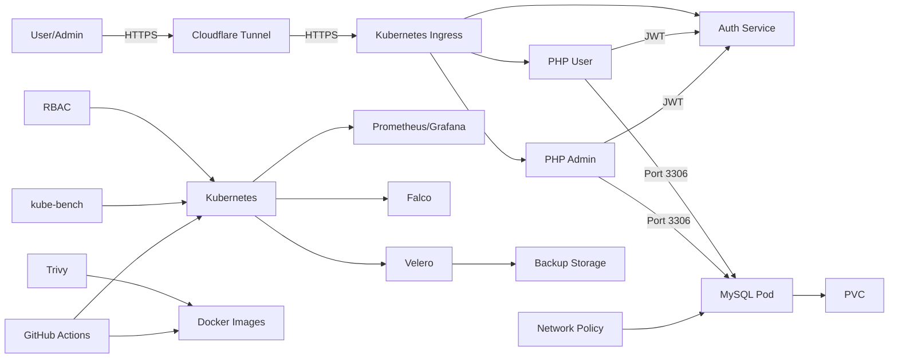

# Hướng dẫn Dự án Quản lý Bán Đồ Ăn Nhanh (QlBanDoAnNhanh)

## Giới thiệu
Dự án *Quản lý Bán Đồ Ăn Nhanh* là một hệ thống web giúp quản lý việc bán đồ ăn nhanh, được triển khai trên Kubernetes và Docker. Hệ thống có hai giao diện chính:
- *User*: Cho người dùng xem sản phẩm, đặt hàng, gửi phản hồi.
- *Admin*: Cho quản trị viên quản lý sản phẩm, đơn hàng, và thống kê.

Dự án tích hợp các biện pháp bảo mật, CI/CD tự động, và giám sát hệ thống, phù hợp cho người mới học DevOps hoặc nhà tuyển dụng muốn đánh giá kỹ năng triển khai ứng dụng web.

Repository: ['https://github.com/BoonnyThien/QlBanDoAnNhanh']('https://github.com/BoonnyThien/QlBanDoAnNhanh.git')

## Tính năng chính
- *Người dùng*: Xem danh sách món ăn, thêm vào giỏ hàng, đặt hàng, gửi phản hồi, đọc bài viết.
- *Quản trị viên*: Quản lý danh mục, sản phẩm, đơn hàng, tài khoản người dùng, bài viết, thống kê doanh thu.
- *Bảo mật*: Mã hóa kết nối HTTPS, quản lý quyền truy cập (RBAC), kiểm soát mạng (Network Policies), quét lỗ hổng container.
- *Triển khai tự động*: CI/CD với GitHub Actions, tự động kiểm tra mã, xây dựng image, và triển khai lên Kubernetes.
- *Giám sát và sao lưu*: Theo dõi hiệu suất với Prometheus/Grafana, sao lưu dữ liệu với Velero.

## Công nghệ sử dụng
- *PHP*: Xây dựng logic cho User và Admin.
- *MySQL*: Lưu trữ dữ liệu (sản phẩm, đơn hàng, tài khoản).
- *Docker*: Container hóa ứng dụng với các image:
  - `buithienboo/qlbandoannhanh-php-app:1.1`: Image chính cho ứng dụng PHP
  - `buithienboo/auth-service:1.0`: Image cho dịch vụ xác thực
- *Kubernetes (Minikube)*: Quản lý và triển khai ứng dụng.
- *Apache*: Web server chạy PHP.
- *Cloudflare Tunnel*: Truy cập ứng dụng từ Internet.
- *GitHub Actions*: CI/CD tự động.
- *Trivy, kube-bench*: Quét bảo mật image và Kubernetes.
- *Prometheus/Grafana*: Giám sát hệ thống.
- *Velero*: Sao lưu và khôi phục dữ liệu.
- *Falco*: Phát hiện hành vi bất thường.
- *RBAC, Network Policies, TLS*: Bảo mật hệ thống.

## Yêu cầu hệ thống
- Docker
- Minikube
- kubectl
- Git
- Cloudflare Tunnel CLI (`cloudflared`)
- Helm (cho monitoring)
- Velero CLI (cho sao lưu)
- Trivy (cho quét bảo mật)

## Sơ đồ kiến trúc dự án



### Giải thích sơ đồ
-*User/Admin:* Người dùng truy cập qua HTTPS thông qua Cloudflare Tunnel và Kubernetes Ingress định tuyến đến User.
-*PHP User/Admin:* Chạy trên Deployment, kết nối MySQL qua cổng 3306, xác thực với Auth Service bằng JWT.
-*Auth Service:* Chạy image buithienboo/auth-service:1.0, xử lý xác thực cho User và Admin.
-*MySQL Pod:* Lưu trữ dữ liệu qlbandoannhanh (bảng tbl_sanpham, tbl_dangky), dùng PersistentVolumeClaim (mysql-pvc) và bảo vệ bằng ConfigMap mysql-security-config (SSL).
-*Network Policy:* Giới hạn truy cập MySQL chỉ từ PHP pods qua cổng 3306, giới hạn HTTP đến PHP pods từ Cloudflare IPs.
-*RBAC:* ServiceAccounts và Roles kiểm soát quyền của PHP, MySQL, Auth Service pods.
-*ConfigMap/Secret:* ConfigMap (mysql-init, mysql-config, mysql-security-config, apache-config, php-config) và Secret (mysql-secret, tls-secret, app-tls) quản lý cấu hình và bảo mật.
-*Prometheus/Grafana:* Thu thập số liệu từ PHP, MySQL, Auth Service pods, hiển thị biểu đồ hiệu suất.
-*Falco:* Phát hiện hành vi bất thường trong Kubernetes, gửi log bảo mật đến Grafana.
-*Velero:* Sao lưu namespace default (MySQL, PHP, Auth Service) vào Backup Storage, hỗ trợ khôi phục.
-*Trivy:* Quét lỗ hổng Docker images (buithienboo/qlbandoannhanh-php-app:1.1, buithienboo/auth-service:1.0) trong CI/CD.
-*kube-bench:* Kiểm tra bảo mật cấu hình Kubernetes theo CIS Benchmarks.
-*GitHub Actions:* Tự động kiểm thử PHP (PHPUnit), xây dựng/push Docker images, triển khai lên Kubernetes.

## Quy trình hoạt động

### 1. Quy trình triển khai ứng dụng
1. *Push mã nguồn*: Đẩy mã lên nhánh `main` trên GitHub.
2. *CI/CD Pipeline*:
   - GitHub Actions chạy kiểm thử PHP với PHPUnit.
   - Xây dựng Docker image và đẩy lên Docker Hub.
   - Triển khai image mới lên Kubernetes bằng `kubectl apply`.
3. *Kubernetes*:
   - Pods PHP (User, Admin) và MySQL được triển khai.
   - Ingress định tuyến lưu lượng đến các service.
4. *Cloudflare Tunnel*: Tạo URL công khai để truy cập ứng dụng.

### 2. Quy trình bảo mật
1. *RBAC*:
   - Tạo ServiceAccounts và Roles để giới hạn quyền của PHP và MySQL pods.
   - Ví dụ: PHP pod chỉ được phép đọc Secrets cần thiết.
2. *Network Policies*:
   - Giới hạn lưu lượng: PHP pods chỉ được truy cập MySQL qua cổng 3306.
   - Chỉ cho phép lưu lượng HTTP từ Cloudflare IP vào PHP pods.
3. *Secrets*:
   - Mật khẩu MySQL, khóa ứng dụng được mã hóa base64 trong Secrets.
   - Ví dụ: `mysql-secrets` chứa `MYSQL_ROOT_PASSWORD`.
4. *TLS*:
   - Tạo chứng chỉ tự ký (`tls-secret`, `app-tls`) để mã hóa kết nối HTTPS.
5. *Container Security*:
   - Trivy quét lỗ hổng trong Docker images trước khi triển khai.
   - Ví dụ: Image `buithienboo/qlbandoannhanh-php-app:1.1` có 104 lỗ hổng.
6. *MySQL Hardening*:
   - ConfigMap `mysql-security-config` bật SSL và giới hạn kết nối.
7. *Auth Service*:
   - Xác thực yêu cầu từ PHP pods bằng JWT.
8. *Falco*:
   - Giám sát và ghi log các hành vi bất thường (ví dụ: truy cập trái phép).

### 3. Quy trình giám sát và sao lưu
1. *Prometheus/Grafana*:
   - ServiceMonitors thu thập số liệu từ PHP và MySQL pods.
   - Grafana hiển thị biểu đồ hiệu suất.
2. *Velero*:
   - Sao lưu namespace `default` định kỳ.
   - Khôi phục dữ liệu khi cần bằng `velero restore`.

## Các bước chạy dự án

### 1. Clone repository
```bash
git config --global core.autocrlf false
git clone https://github.com/BoonnyThien/QlBanDoAnNhanh.git
cd ~/QlBanDoAnNhanh
```

### 2. Chạy ứng dụng với Docker
```bash
cd ~/QlBanDoAnNhanh/docker
docker compose up -d
```

Truy cập:
- User: 'http://localhost:8080'
- Admin: 'http://localhost:8081'

### 3. Chạy ứng dụng với Kubernetes
```bash
cd ~/QlBanDoAnNhanh
chmod +x ColorEmoji.sh
./ColorEmoji.sh

cd ~/QlBanDoAnNhanh/k8s
chmod +x setup_and_repair.sh
./setup_and_repair.sh
```

Truy cập qua URL từ Cloudflare Tunnel (xem log script để lấy URL).

### 4. Thiết lập bảo mật
```bash
cd ~/QlBanDoAnNhanh/k8s/security
chmod +x deploy-security.sh
./deploy-security.sh
```

### 5. Kiểm tra bảo mật
```bash
cd ~/QlBanDoAnNhanh/k8s/security
chmod +x check-security.sh
./check-security.sh
```

### 6. Kiểm tra trạng thái
```bash
cd ~/QlBanDoAnNhanh/k8s/
# Kiểm tra pods
kubectl get pods

# Kiểm tra services
kubectl get services

# Kiểm tra logs
kubectl logs -l app=php
kubectl logs -l app=mysql
```

## Lệnh bổ sung

### Dừng Docker containers
```bash
cd docker
docker compose down
```

### Xóa tài nguyên Kubernetes
```bash
cd k8s
kubectl delete -f .
minikube delete
```

### Xem logs Kubernetes
```bash
kubectl logs -l app=php
kubectl logs -l app=php-admin
kubectl logs -l app=mysql
```

## Thông tin bổ sung từ thư mục k8s

Dự án bao gồm nhiều script triển khai trong thư mục `k8s/`:

- *Scripts triển khai PHP*:
  - `deploy_php_step_12_1.sh` đến `deploy_php_step_12_6.sh`: Các bước triển khai thiết lập .yaml
  - `deploy_php_step_16_1.sh` đến `deploy_php_step_16_5.sh`: Các bước triển khai kiểm tra 
  - `deploy_php_step_17.sh`: Triển khai Cloudflare 

- *Scripts thiết lập và sửa chữa*:
  - `setup_and_repair.sh`: Script chính để thiết lập và sửa chữa hệ thống
  - `setup_and_repair1.sh`: Script chính để thiết lập và sửa chữa hệ thống tiếp

- *Scripts bảo mật và giám sát*:
  - `container-security.sh`: Kiểm tra bảo mật container
  - `install-monitoring.sh`: Cài đặt hệ thống giám sát

- *Cấu hình Kubernetes*:
  - `php-service.yaml`: Cấu hình service PHP
  - `mysql-service.yaml`: Cấu hình service MySQL
  - `mysql-deployment.yaml`: Cấu hình deployment MySQL
  - `mysql-pvc.yaml`: Cấu hình persistent volume claim cho MySQL
  - `mysql-config.yaml`: Cấu hình MySQL
  - `apache-config.yaml`: Cấu hình Apache

- *Logs*:
  - `cloudflared-User.log`, `cloudflared-User.log`, `cloudflared-admin.log`: Logs của Cloudflare Tunnel
  - `port-forward-User.log`, `port-forward-User.log`, `port-forward-admin.log`: Logs của port forwarding

## Lưu ý
- Đảm bảo cài đặt đầy đủ các công cụ (Docker, Minikube, kubectl, v.v.).
- File bảo mật (.crt, .key) nằm trong thư mục gốc, dùng để mã hóa kết nối.
- Kết quả quét bảo mật (scan-*.txt) cho thấy cần cập nhật image để giảm lỗ hổng.
- CI/CD tự động chạy khi đẩy mã lên nhánh main, kiểm tra trong tab Actions trên GitHub.
- *Lưu ý về Cloudflare*: Do sử dụng bản thử nghiệm, URL Cloudflare Tunnel thay đổi mỗi lần khởi động lại. Để lấy URL hiện tại, hãy kiểm tra logs của Cloudflare Tunnel:
```bash
kubectl logs -l app=cloudflared
```