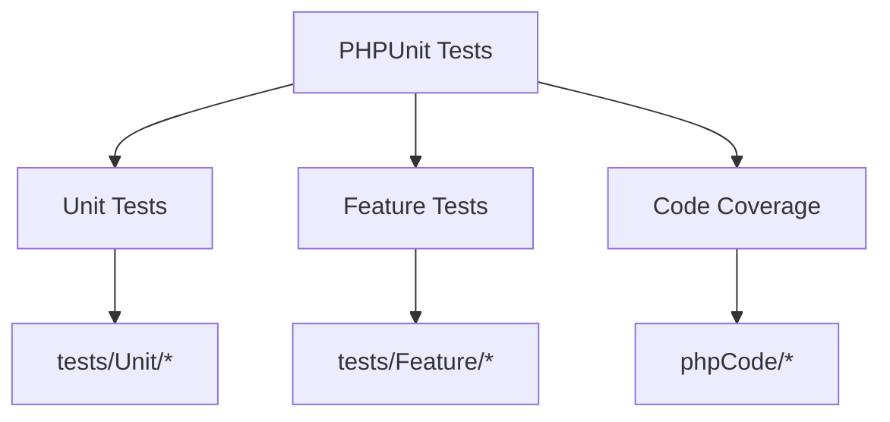
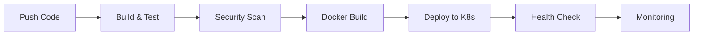
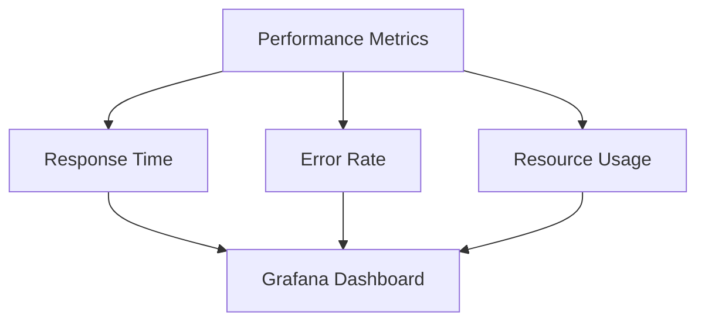

# Fast Food Application on Kubernetes

[🇻🇳 Tiếng Việt](#tiếng-việt) | [🇬🇧 English](#english)


# Tiếng Việt

## Giới thiệu
Dự án này triển khai một ứng dụng web PHP về đồ ăn nhanh trên Kubernetes, sử dụng MySQL làm cơ sở dữ liệu. Ứng dụng được container hóa bằng Docker và triển khai trên Kubernetes để đảm bảo khả năng mở rộng và bảo trì.

## Yêu cầu hệ thống
- Docker Engine 20.10+
- Docker Compose 2.0+
- Kubernetes (Minikube hoặc EKS/GKE)
- kubectl
- PHP 8.1+
- Composer

## Bắt đầu nhanh

### 1. Thiết lập môi trường phát triển
```bash
# Clone repository
git clone [repository-url]
cd doannhanh

# Khởi động Docker containers
cd ~/doannhanh/docker && docker compose up -d

# Truy cập ứng dụng
http://localhost:8080/
http://localhost:8080/admin/
```

### 2. Triển khai Kubernetes
```bash
# Khởi động Minikube
minikube start --driver=docker --memory=3072 --cpus=2 --addons=ingress

# Triển khai ứng dụng
cd ~/doannhanh
./k8s/setup-and-repair.sh

# Lấy URL ứng dụng
minikube service php-service --url
```

## Cấu trúc dự án
- **k8s/**: Cấu hình và script Kubernetes
- **docker/**: Mã nguồn PHP và tệp SQL
- **docs/**: Tài liệu chi tiết
  - `setup.md`: Hướng dẫn cài đặt chi tiết
  - `security.md`: Hướng dẫn triển khai bảo mật
  - `deployment.md`: Quy trình triển khai

## Tính năng bảo mật
- RBAC (Kiểm soát truy cập dựa trên vai trò)
- Network Policies
- Quản lý Secrets
- Bảo mật Container
- Bảo vệ dữ liệu
- Giám sát & Sao lưu

## Môi trường triển khai

### Development
```bash
# Build và khởi động containers
docker compose build
docker compose up -d
```

### Staging
```bash
# Build và đẩy images
docker build -t registry.example.com/app:staging .
docker push registry.example.com/app:staging

# Triển khai lên Kubernetes
kubectl set image deployment/app app=registry.example.com/app:staging -n staging
```

### Production
```bash
# Build production images
docker build -t registry.example.com/app:1.0.0 .
docker push registry.example.com/app:1.0.0

# Triển khai lên production
kubectl apply -f k8s/production/
```

## Xử lý sự cố

### Vấn đề thường gặp
1. **Docker không khởi động**
   - Kiểm tra trạng thái: `sudo systemctl status docker`
   - Khởi động lại: `sudo systemctl restart docker`

2. **Vấn đề Kubernetes**
   - Kiểm tra trạng thái: `minikube status`
   - Khởi động lại: `minikube stop && minikube start`

3. **Lỗi kết nối database**
   - Kiểm tra logs MySQL: `docker logs mysql-container`
   - Kiểm tra kết nối: `mysql -h localhost -u root -p`

### Kiểm tra tài nguyên Kubernetes
```bash
# Kiểm tra tất cả tài nguyên
kubectl get all

# Kiểm tra trạng thái pod
kubectl get pods

# Xem logs của pod
kubectl logs <tên-pod>
```

## Giám sát
Triển khai các thành phần giám sát:
```bash
chmod +x k8s/install-monitoring.sh
./k8s/install-monitoring.sh
```

# English

## Introduction
This project implements a PHP-based fast food web application on Kubernetes, using MySQL as the database. The application is containerized using Docker and deployed on Kubernetes for scalability and maintainability.

## Prerequisites
- Docker Engine 20.10+
- Docker Compose 2.0+
- Kubernetes (Minikube or EKS/GKE)
- kubectl
- PHP 8.1+
- Composer

## Quick Start

### 1. Development Setup
```bash
# Clone repository
git clone [repository-url]
cd doannhanh

# Start Docker containers
cd ~/doannhanh/docker && docker compose up -d

# Access the application
http://localhost:8080/
http://localhost:8080/admin/
```

### 2. Kubernetes Deployment
```bash
# Start Minikube
minikube start --driver=docker --memory=3072 --cpus=2 --addons=ingress

# Deploy the application
cd ~/doannhanh
./k8s/setup-and-repair.sh

# Get application URL
minikube service php-service --url
```

## Project Structure
- **k8s/**: Kubernetes configurations and scripts
- **docker/**: PHP source code and SQL files
- **docs/**: Detailed documentation
  - `setup.md`: Detailed setup instructions
  - `security.md`: Security implementation guide
  - `deployment.md`: Deployment procedures

## Security Features
- RBAC (Role-Based Access Control)
- Network Policies
- Secrets Management
- Container Security
- Data Protection
- Monitoring & Backup

## Deployment Environments

### Development
```bash
# Build and start containers
docker compose build
docker compose up -d
```

### Staging
```bash
# Build and push images
docker build -t registry.example.com/app:staging .
docker push registry.example.com/app:staging

# Deploy to Kubernetes
kubectl set image deployment/app app=registry.example.com/app:staging -n staging
```

### Production
```bash
# Build production images
docker build -t registry.example.com/app:1.0.0 .
docker push registry.example.com/app:1.0.0

# Deploy to production
kubectl apply -f k8s/production/
```

## Troubleshooting

### Common Issues
1. **Docker not starting**
   - Check status: `sudo systemctl status docker`
   - Restart: `sudo systemctl restart docker`

2. **Kubernetes issues**
   - Check status: `minikube status`
   - Restart: `minikube stop && minikube start`

3. **Database connection issues**
   - Check MySQL logs: `docker logs mysql-container`
   - Test connection: `mysql -h localhost -u root -p`

### Kubernetes Resources Check
```bash
# Check all resources
kubectl get all

# Check pod status
kubectl get pods

# View pod logs
kubectl logs <pod-name>
```

## Monitoring
Deploy monitoring components:
```bash
chmod +x k8s/install-monitoring.sh
./k8s/install-monitoring.sh
```

---

# E-commerce Project Infrastructure Documentation

## 📋 Table of Contents
- [Testing Infrastructure](#testing-infrastructure)
- [CI/CD Pipeline](#cicd-pipeline)
- [Automation Scripts](#automation-scripts)
- [Monitoring & Visualization](#monitoring--visualization)

## 🧪 Testing Infrastructure

### PHPUnit Configuration
Our testing infrastructure is configured using PHPUnit and follows PSR-4 autoloading standards:



### Test Structure
```
tests/
├── Unit/           # Unit tests for individual components
└── Feature/        # Integration/Feature tests
```

Key files:
- `phpunit.xml`: Test configuration and coverage settings
- `composer.json`: Autoloading and dependency configuration

To run tests locally:
```bash
composer test       # Runs all tests
./vendor/bin/phpunit tests/Unit     # Run unit tests only
./vendor/bin/phpunit tests/Feature  # Run feature tests only
```

## 🔄 CI/CD Pipeline

Our CI/CD pipeline is fully automated using GitHub Actions:



### Pipeline Stages

1. **Build & Test**
   - Runs PHPUnit tests
   - Checks code style
   - Validates dependencies

2. **Security Scan**
   - Container scanning with Trivy
   - Kubernetes security with kube-bench
   - Dependency vulnerability checks

3. **Docker Build & Push**
   - Builds optimized container
   - Pushes to container registry
   - Tags with commit SHA

4. **Kubernetes Deployment**
   - Rolling updates
   - Health checks
   - Resource monitoring

### Visualizing Pipeline Status

You can monitor the pipeline:

1. GitHub Actions Dashboard: `.github/workflows/`
   - `ci-cd.yml`: Main pipeline
   - `ci-cd-tests.yml`: Extended testing

2. Real-time Monitoring:
```bash
# View deployment status
kubectl get deployments -w

# Monitor pods
kubectl get pods -w

# Check logs
kubectl logs -f deployment/app
```

## 🤖 Automation Scripts

### Available Scripts

1. **Test Automation**
```bash
#!/bin/bash
# test-all.sh
echo "🧪 Running all tests..."
composer test

echo "📊 Generating coverage report..."
./vendor/bin/phpunit --coverage-html coverage/
```

2. **Deployment Automation**
```bash
#!/bin/bash
# deploy.sh
echo "🚀 Starting deployment..."
docker build -t app:latest .
kubectl apply -f k8s/
kubectl rollout status deployment/app
```

3. **Monitoring Script**
```bash
#!/bin/bash
# monitor.sh
echo "📊 Checking system status..."
kubectl top pods
kubectl get events --sort-by=.metadata.creationTimestamp
```

## 📊 Monitoring & Visualization

### Real-time Metrics

1. **Application Health**
```bash
# View real-time health metrics
curl http://app.example.com/health
```

2. **Resource Usage**
```bash
# CPU and Memory usage
kubectl top pods
```

3. **Logs Visualization**
```bash
# Stream logs in real-time
kubectl logs -f -l app=app
```

### Grafana Dashboards

Access metrics visualization at:
- Application metrics: `http://grafana.your-domain.com/d/app`
- Infrastructure metrics: `http://grafana.your-domain.com/d/infra`

## 🚀 Quick Start

1. Clone the repository
```bash
git clone <repository-url>
```

2. Install dependencies
```bash
composer install
```

3. Run tests
```bash
composer test
```

4. Start monitoring
```bash
./scripts/monitor.sh
```

## 📈 Performance Metrics

View real-time performance metrics:



## 🔍 Troubleshooting

Common issues and solutions:

1. **Tests failing?**
```bash
# Check logs
./vendor/bin/phpunit --debug
```

2. **Deployment issues?**
```bash
# Check pod status
kubectl describe pod <pod-name>
```

3. **Performance issues?**
```bash
# View resource usage
kubectl top pods --containers
``` 
